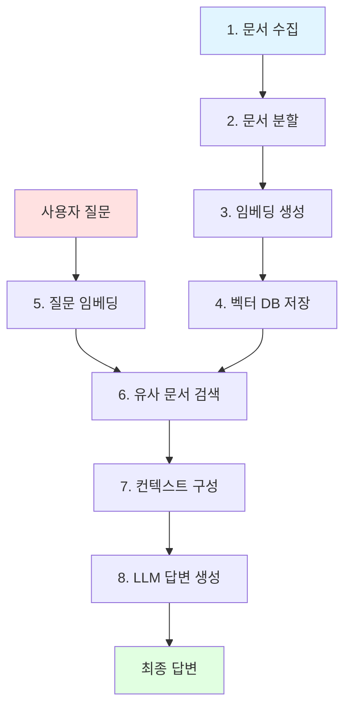

# RAG (Retrieval-Augmented Generation)

## 목차
- [RAG란?](#rag란)
- [RAG의 작동 원리](#rag의-작동-원리)
- [RAG의 장점](#rag의-장점)
- [RAG vs 일반 LLM](#rag-vs-일반-llm)
- [설치 및 설정](#설치-및-설정)
- [실습 예제](#실습-예제)
- [프로젝트 구조](#프로젝트-구조)
- [참고 자료](#참고-자료)

## RAG란?

**RAG (Retrieval-Augmented Generation)**는 대규모 언어 모델(LLM)의 성능을 향상시키는 혁신적인 기술입니다.

### 쉬운 비유로 이해하기

시험을 치르는 학생을 생각해봅시다:

- **일반 LLM**: 머릿속 지식만으로 문제를 풀어야 하는 학생 (암기한 내용에만 의존)
- **RAG 시스템**: 교과서나 참고서를 찾아보면서 문제를 풀 수 있는 학생 (외부 자료 참고 가능)

RAG는 AI가 **외부 지식 베이스를 참고하여** 더 정확하고 최신의 정보를 제공할 수 있게 해줍니다.

### 핵심 개념

RAG는 다음 두 가지 핵심 기능을 결합합니다:

1. **Retrieval (검색)**: 관련 문서나 정보를 찾아오기
2. **Generation (생성)**: 찾은 정보를 바탕으로 답변 생성

## RAG의 작동 원리

### 전체 프로세스



### 단계별 상세 설명

#### 📚 1단계: 인덱싱 (Indexing) - 사전 준비

```python
# 예시: 회사 문서 준비
documents = [
    "우리 회사의 휴가 정책은 연간 15일입니다.",
    "재택근무는 주 2회까지 가능합니다.",
    "점심시간은 12시부터 1시까지입니다."
]

# 문서를 벡터로 변환하여 저장
vector_store.add_documents(documents)
```

#### 🔍 2단계: 검색 (Retrieval) - 질문 시점

```python
# 사용자 질문
question = "휴가는 몇 일인가요?"

# 유사한 문서 검색
relevant_docs = vector_store.search(question, top_k=3)
# 결과: ["우리 회사의 휴가 정책은 연간 15일입니다."]
```

#### 💬 3단계: 생성 (Generation) - 답변 생성

```python
# 검색된 문서와 질문을 결합
context = "\n".join(relevant_docs)
prompt = f"다음 정보를 바탕으로 질문에 답하세요:\n{context}\n\n질문: {question}"

# LLM이 답변 생성
answer = llm.generate(prompt)
# 결과: "회사의 연차 휴가는 연간 15일입니다."
```

## RAG의 장점

### ✅ 1. 최신 정보 활용
- LLM의 학습 데이터는 과거 시점에 고정
- RAG는 최신 문서를 실시간으로 참조 가능

**예시:**
```
질문: "2024년 4분기 매출은?"
일반 LLM: "죄송합니다. 해당 정보를 모릅니다."
RAG: "2024년 4분기 매출은 150억원입니다." (최신 재무보고서 참조)
```

### ✅ 2. 환각(Hallucination) 감소
- 일반 LLM: 모르는 정보를 지어낼 수 있음
- RAG: 실제 문서를 기반으로 답변 → 신뢰도 향상

### ✅ 3. 도메인 특화
- 회사 내부 문서, 전문 자료 등을 지식 베이스로 활용
- 특정 분야에 최적화된 답변 가능

### ✅ 4. 투명성과 추적성
- 답변의 출처를 명확히 표시 가능
- 어떤 문서를 참고했는지 확인 가능

### ✅ 5. 비용 효율성
- 전체 모델을 재학습할 필요 없음
- 문서만 업데이트하면 됨

## RAG vs 일반 LLM

| 구분 | 일반 LLM | RAG 시스템 |
|------|----------|-----------|
| 지식 출처 | 학습 데이터 (고정) | 외부 문서 (동적) |
| 최신 정보 | ❌ 학습 시점까지만 | ✅ 실시간 업데이트 가능 |
| 환각 현상 | ⚠️ 빈번 | ✅ 크게 감소 |
| 도메인 특화 | ❌ 어려움 | ✅ 쉬움 |
| 답변 출처 | ❌ 불명확 | ✅ 명확 |
| 비용 | 💰 재학습 비용 높음 | 💰 문서 업데이트만 필요 |

## 설치 및 설정

### 1. 저장소 클론

```bash
git clone <repository-url>
cd rag
```

### 2. 가상환경 생성 및 활성화

```bash
# Python 가상환경 생성
python -m venv venv

# 활성화 (Windows)
venv\Scripts\activate

# 활성화 (Mac/Linux)
source venv/bin/activate
```

### 3. 의존성 설치

```bash
pip install -r requirements.txt
```

### 4. 환경 변수 설정

`.env` 파일을 생성하고 OpenAI API 키를 설정하세요:

```bash
# .env 파일
OPENAI_API_KEY=your-api-key-here
```

## 실습 예제

### 예제 1: 기본 RAG 시스템

`rag-example/basic_rag.py`를 실행하여 기본 RAG 시스템을 체험해보세요:

```bash
cd rag-example
python basic_rag.py
```

**코드 설명:**

```python
from langchain_openai import OpenAIEmbeddings, ChatOpenAI
from langchain_community.vectorstores import FAISS
from langchain.chains import RetrievalQA
from langchain_core.documents import Document

# 1. 샘플 문서 준비
documents = [
    Document(page_content="파이썬은 1991년 귀도 반 로섬이 개발한 프로그래밍 언어입니다."),
    Document(page_content="파이썬은 간결하고 읽기 쉬운 문법으로 초보자에게 인기가 많습니다."),
    Document(page_content="파이썬은 데이터 과학, 웹 개발, 인공지능 등 다양한 분야에서 사용됩니다.")
]

# 2. 벡터 스토어 생성
embeddings = OpenAIEmbeddings()
vector_store = FAISS.from_documents(documents, embeddings)

# 3. RAG 체인 구성
llm = ChatOpenAI(temperature=0)
qa_chain = RetrievalQA.from_chain_type(
    llm=llm,
    retriever=vector_store.as_retriever(),
    return_source_documents=True
)

# 4. 질문하기
result = qa_chain.invoke({"query": "파이썬은 누가 만들었나요?"})
print(f"답변: {result['result']}")
print(f"출처: {result['source_documents'][0].page_content}")
```

### 예제 2: PDF 문서 RAG

`rag-example/pdf_rag.py`를 실행하여 PDF 문서를 활용한 RAG를 체험해보세요:

```bash
python pdf_rag.py
```

### 예제 3: 웹 페이지 RAG

웹 페이지를 크롤링하여 RAG 시스템을 구축하는 예제:

```bash
python web_rag.py
```

## 프로젝트 구조

```
rag/
├── README.md                 # 이 문서
├── requirements.txt          # 필요한 패키지 목록
├── .env.example             # 환경 변수 예시
├── llm-chat/                # 기본 채팅 앱
│   ├── main.py
│   └── utils.py
├── rag-example/             # RAG 실습 예제 (새로 추가)
│   ├── basic_rag.py         # 기본 RAG 예제
│   ├── pdf_rag.py           # PDF 문서 RAG
│   ├── web_rag.py           # 웹 페이지 RAG
│   └── chat_with_docs.py    # 문서 채팅 인터페이스
└── sample-docs/             # 샘플 문서 (새로 추가)
    ├── company_policy.txt   # 회사 정책 문서
    ├── product_manual.txt   # 제품 매뉴얼
    └── faq.txt             # 자주 묻는 질문
```

## 실제 사용 사례

### 1. 고객 지원 챗봇
```
지식 베이스: 제품 매뉴얼, FAQ, 기술 문서
활용: 고객 문의에 정확한 답변 제공
```

### 2. 사내 지식 검색
```
지식 베이스: 회사 규정, 업무 매뉴얼, 프로젝트 문서
활용: 직원들의 빠른 정보 조회
```

### 3. 법률/의료 자문
```
지식 베이스: 법률 판례, 의료 논문, 가이드라인
활용: 전문적이고 정확한 정보 제공
```

### 4. 학습 도우미
```
지식 베이스: 교과서, 강의 노트, 참고 자료
활용: 학생들의 질문에 맞춤형 답변
```

## 주요 구성 요소

### 1. 문서 로더 (Document Loaders)
- PDF, Word, TXT, CSV, 웹페이지 등 다양한 형식 지원
- 예: `PyPDFLoader`, `TextLoader`, `WebBaseLoader`

### 2. 텍스트 분할기 (Text Splitters)
- 긴 문서를 적절한 크기로 분할
- 예: `RecursiveCharacterTextSplitter`

### 3. 임베딩 모델 (Embedding Models)
- 텍스트를 벡터로 변환
- 예: `OpenAIEmbeddings`, `HuggingFaceEmbeddings`

### 4. 벡터 스토어 (Vector Stores)
- 벡터를 저장하고 검색
- 예: `FAISS`, `Chroma`, `Pinecone`

### 5. 검색기 (Retriever)
- 질문과 관련된 문서 찾기
- 다양한 검색 전략 지원

### 6. LLM (Large Language Model)
- 최종 답변 생성
- 예: `ChatOpenAI`, `ChatAnthropic`

## 고급 기법

### 1. 하이브리드 검색
- 키워드 검색 + 시맨틱 검색 결합
- 더 정확한 문서 검색

### 2. 리랭킹 (Re-ranking)
- 검색된 문서를 재정렬하여 정확도 향상

### 3. 질문 재작성
- 사용자 질문을 더 나은 검색 쿼리로 변환

### 4. 멀티 쿼리
- 하나의 질문을 여러 관점에서 검색

## 성능 최적화 팁

### 1. 청크 크기 조정
```python
# 적절한 청크 크기 설정
text_splitter = RecursiveCharacterTextSplitter(
    chunk_size=1000,        # 문서 특성에 맞게 조정
    chunk_overlap=200       # 문맥 유지를 위한 오버랩
)
```

### 2. 검색 문서 수 조정
```python
# top_k 값으로 검색할 문서 수 조정
retriever = vector_store.as_retriever(
    search_kwargs={"k": 3}  # 3-5개가 일반적으로 적절
)
```

### 3. 캐싱 활용
- 자주 사용되는 쿼리 결과를 캐싱
- 응답 속도 향상 및 API 비용 절감

## 자주 묻는 질문 (FAQ)

### Q1: RAG와 Fine-tuning의 차이는?
**A:**
- **Fine-tuning**: 모델 자체를 재학습 (비용 높음, 시간 소요)
- **RAG**: 외부 지식만 업데이트 (비용 낮음, 즉시 반영)

### Q2: 벡터 스토어는 어떤 것을 선택해야 하나요?
**A:**
- **소규모/프로토타입**: FAISS (로컬, 무료)
- **중규모**: Chroma (오픈소스, 자체 호스팅)
- **대규모/프로덕션**: Pinecone, Weaviate (관리형 서비스)

### Q3: RAG의 한계는?
**A:**
- 검색된 문서의 품질에 의존
- 벡터 스토어 구축 및 관리 필요
- 실시간 정보는 여전히 제한적

### Q4: 한국어 문서에도 잘 작동하나요?
**A:**
네! 최신 임베딩 모델들은 한국어를 잘 지원합니다.
- OpenAI Embeddings: 한국어 지원 우수
- 한국어 특화 모델: `jhgan/ko-sroberta-multitask` 등

## 참고 자료

### 논문
- [RAG 원본 논문 (2020)](https://arxiv.org/abs/2005.11401)
- [Retrieval-Augmented Generation for Knowledge-Intensive NLP Tasks](https://arxiv.org/abs/2005.11401)

### 문서
- [LangChain RAG Tutorial](https://python.langchain.com/docs/use_cases/question_answering/)
- [OpenAI Embeddings Guide](https://platform.openai.com/docs/guides/embeddings)

### 도구 및 프레임워크
- [LangChain](https://github.com/langchain-ai/langchain) - RAG 구현 프레임워크
- [LlamaIndex](https://github.com/run-llama/llama_index) - 데이터 프레임워크
- [FAISS](https://github.com/facebookresearch/faiss) - 벡터 유사도 검색
- [Chroma](https://github.com/chroma-core/chroma) - 벡터 데이터베이스

## 기여하기

이 프로젝트에 기여하고 싶으시다면:
1. Fork this repository
2. Create your feature branch
3. Commit your changes
4. Push to the branch
5. Create a Pull Request

## 라이센스

MIT License

---

**Made with ❤️ for better RAG understanding**
